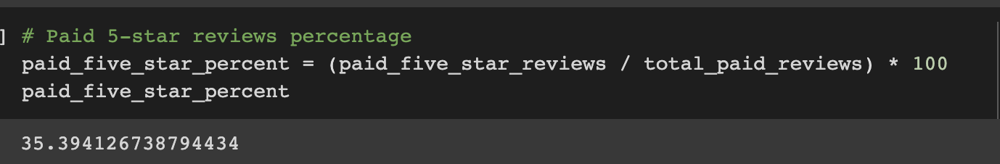

# Amazon_Vine_Analysis

## Project Overview
This purpose of this project is to analyze Amazon Vine program and determine if there is a bias toward favorable reviews from Vine members. This analysis uses PySpark to perform the ETL process to extract the dataset, transform the data, on google collab notebook, connect to an AWS RDS instance, load the transformed data into pgAdmin and calculate different metrics.

The reviews focused on in this project is Beauty.

## Results

### Total Number of Reviews

The total number of vine reviews is 647.

The total number of non-vine reviews is 74113.

### Total Five-star Reviews

The total number of five-star reviews is 229.

The total number of five-star reviews is 43217.

### Percentage of 5-star Reviews

The percentage of 5-star vine reviews is 35.4%.

The percenrtage of 5-star non-vine reviews is 58.3%.

## Summary
58.3% of the reviews in the Non-Vine program were 5 stars reviews whereas the percentage in the Vine reviews is only 35.4%. This describes there is no positivity bias for reviews in the Vine program. In conclusion, customers don't feel a positivity bias for leaving good reviews in the paid (vine) program as there are so few and not so many well-rated. 
An additional analysis we could perform is the statistical distribution (mean, median and mode) of the star rating for the Vine and non-Vine reviews.

## Resources
Software: Google Colab Notebook, PostgreSQL 11.9, pgAdmin 4, AWS

